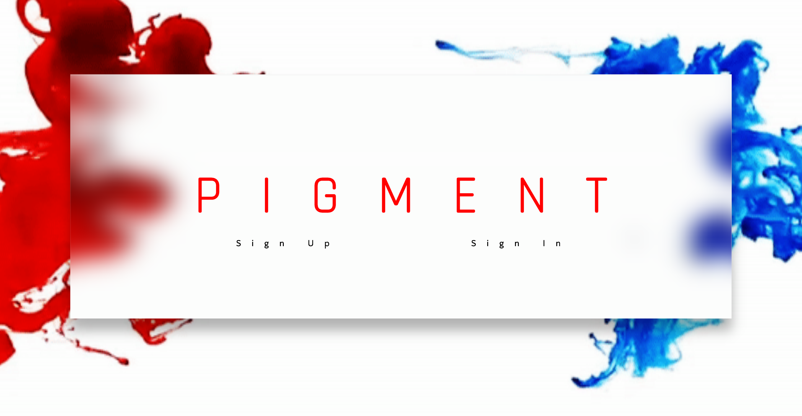
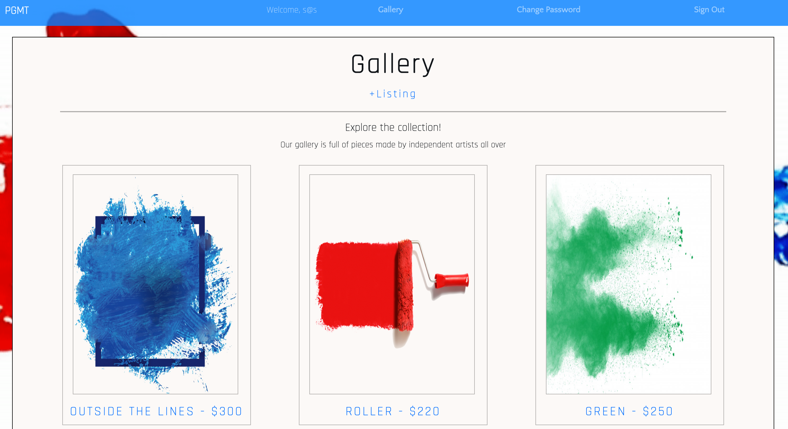
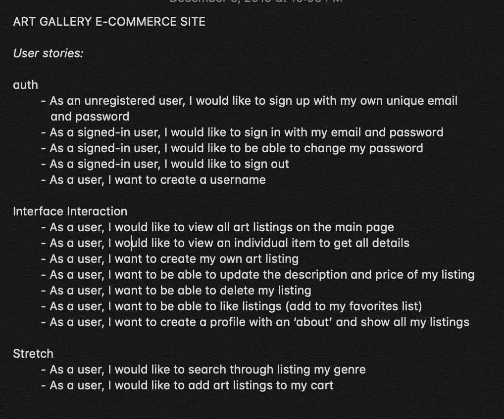
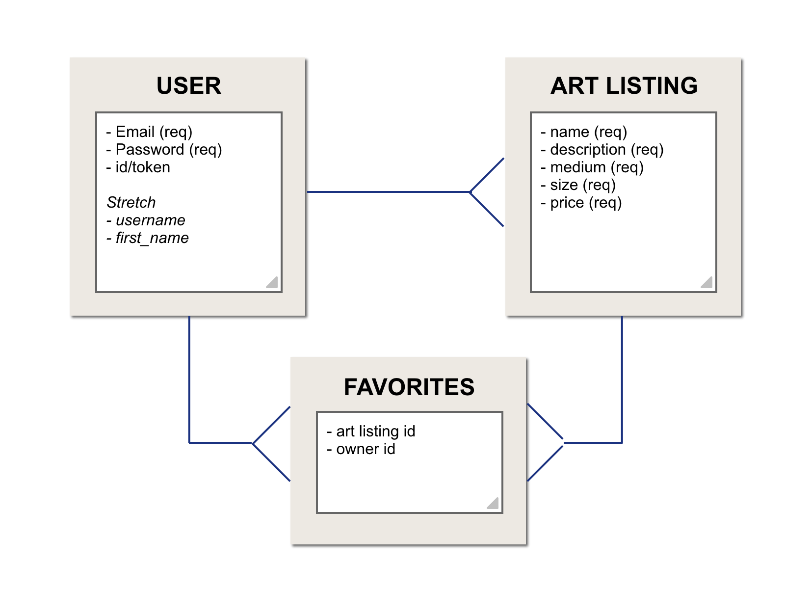
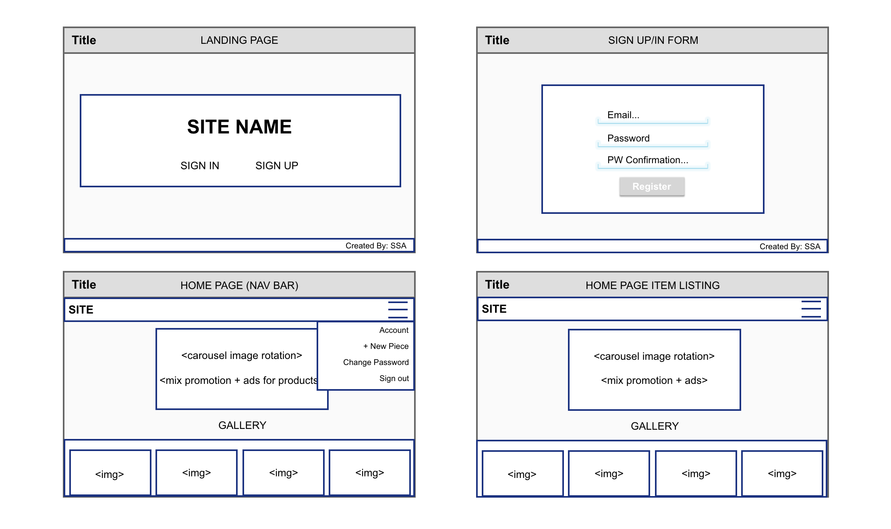
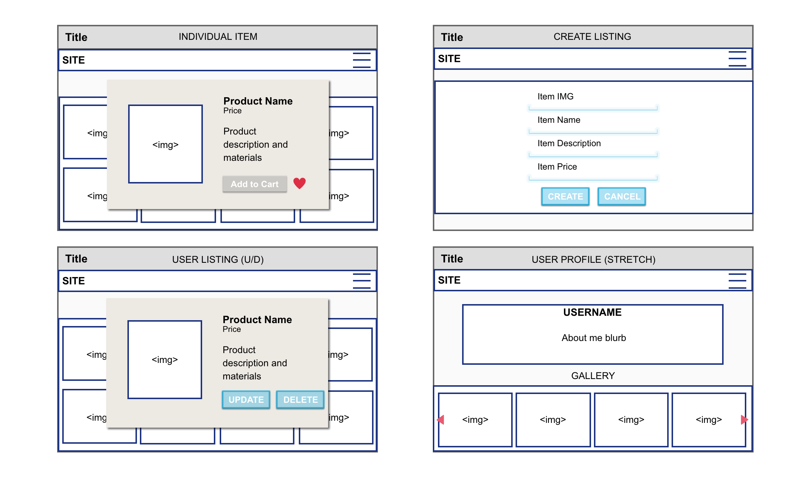

# Pigment: E-commerce React App

This is a single page application that welcomes users to shop through artworks made by independent artists. The User, once registered with their own unique email and password, can scroll through all artworks and select one to get more information regarding that piece. The User can also make their own listings which include details on the piece, price, and an uploaded image! The User can then find their listings in the gallery and upon selection, have the option to update or delete the listing (these options are not available on artworks that do not belong to the User). This application was build within 4 business days (and a weekend headstart)

*** When demoing the application, please do not use a real email or password when registering ***

ex: email: demo@pgmt, password: demo

## Links
- [Pigment Live Site](https://sangelici.github.io/pigment-react-client/)
- [Pigment API Repository](https://github.com/sangelici/pigment-api)
- [Pigment Live API](https://pure-thicket-58776.herokuapp.com/artworks/)

## Technologies
- React
- Express
- MongoDB
- Mongoose
- Node.js
- AWS S3
- Multer
- JavaScript
- Curl Scripts
- JSX/HTML5
- CSS
- Sass
- Bootstraps
- Git

## Unresolved Problems
- While there are no errors, the user at the moment cannot update the image in their listings. They would have to delete the listing and remake it if they wanted to use a different image. This isn't a very user friendly feature, and it will require the busboy body-parser package to modify that data from the multipart form.

## Story

This was the final capstone project of my Software Engineering Immersive course with General Assembley. I anticipated this for weeks. I had a lot of ambition coming in, and the planning was long and full of big ideas and cool features to make this e-commerce sight something to behold. The idea of selling artworks came from my own personal passion as a fine artist, and the reality that I have't come across a site that's meant for independent artists to sell their works. Most artists use social media to promote theirs works and open commisions for other users, but what if there was one place for people to come to and buy fully realized pieces? Thus, Pigment was born!

I started with a lot of planning on paper. User stories, wireframes, lists upon lists on just how I would approach building my app. Once I figure out what my CRUD actions would be, and potential stretch goals to work on after the project due date, I had to figure out which technologies would be best. I settled on a MERN approach (MongoDB, Express, React, Node) and got started.

Working through the API was smooth sailing when it came to the basic set up. I used curl scripts to test each request in the terminal for my artworks with success. As i worked, I ran into major challenges when I started to implement AWS and image upload functionality. I found difficulty in keeping track of all my files, especially when switching between the front and back end, and parsing through each line in my requests to make sure that the right data was being sent and saved. Long hours were spent researching FormData and familiarizing myself with how it works. Thankfully those hourse did eventually pay off, and I was able to finally create a resourse with an Image file attached that can be viewed. As stated above, the next challenge will be allowing the user to update that image on their listings.

Overall, this project was a major challenge, and I pushed myself to be aware of each step that I took as I built my app. This means, on top of all my lists, I worked hard to keep track of my work flow. Each feature was given a branch, and merged with development upon completion. I also created issues within my repository to keep track of my research and progress of large challenges as I worked. I feel as though I pushed myself on this project, and I'm proud of what I could accomplishments.

## Future Goals
- Implement favorites resource into the front end.
  - This will allow users to favorite arworks and store them in a favorites list that they can reference
- Create a profile for the user where they can add a small 'About the Artist' section and index all of their artworks for other users to view.
- Build a cart resource so users can select an artwork they like and add it to their carts for purchase
- Build a checkout for once a user settles of their cart selections and wants to continue with their purchase

## App Preview

## User Stories

## ERD + Wireframes

